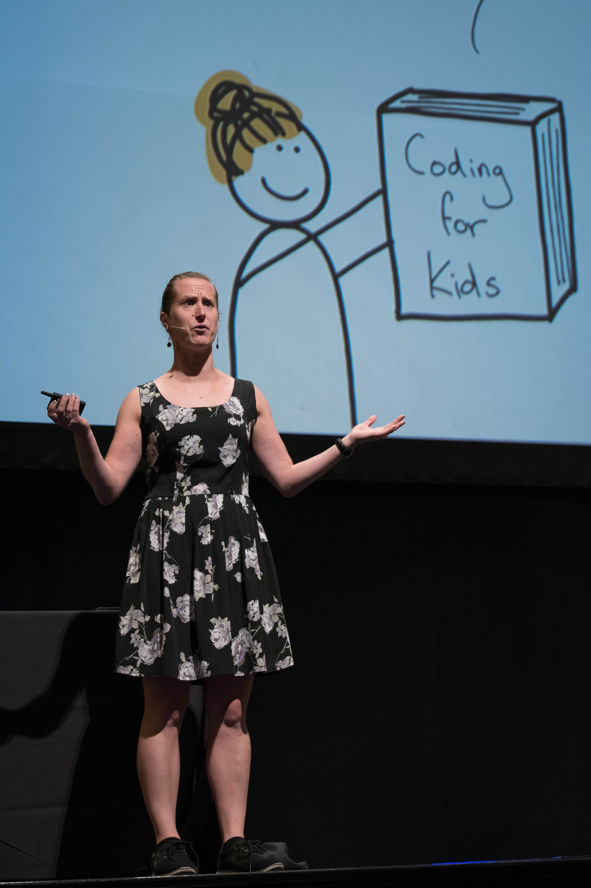
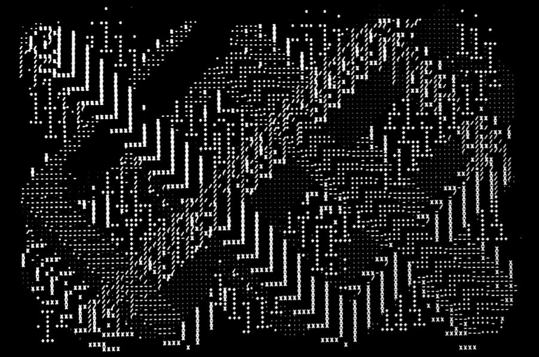
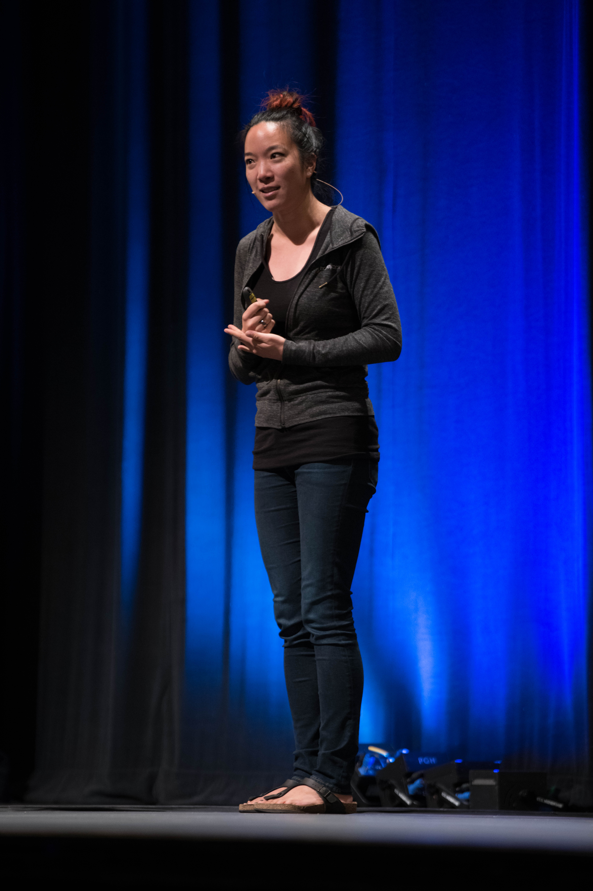
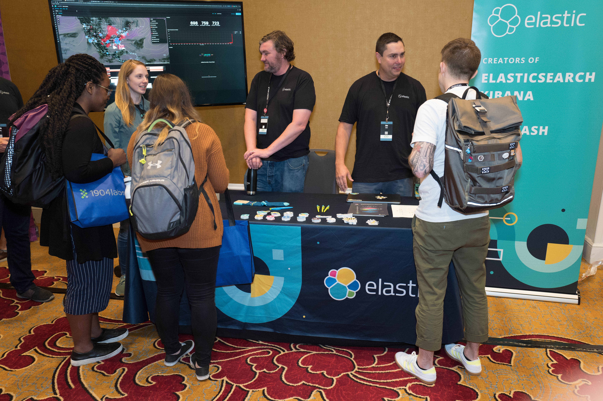
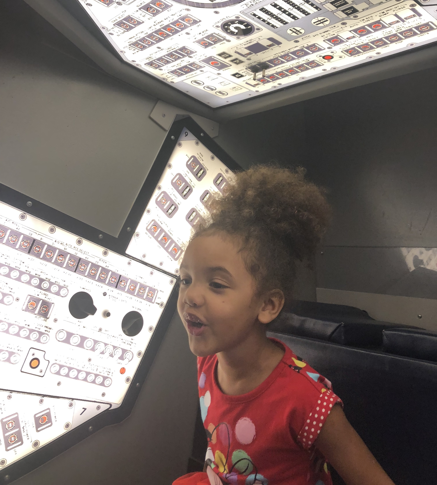

I recently got back from St. Louis, Missouri where I attended [Strange Loop](https://www.thestrangeloop.com). It was my third time there, and it's my favorite conference. Here are some notes I took. Hope you find them interesting!

St. Louis is around a five hour drive south from my home in South Amana, Iowa. I brought my wife and four kids along for the trip. We got there in the afternoon and had plenty of time to get dinner at [Rosalita's Cantina](https://www.rosalitascantina.com) and go to the best part of the conference: [City Museum](https://www.citymuseum.org/)!

### City Museum

Strange Loop has held a private party at City Museum for the last few years, and it's just the best thing ever. It's one of those places where I could keep writing pages and pages and you just wouldn't understand; you just have to go there.

The best description I could come up with is this: You know Terry Gilliam? The guy from Monty Python who did all the animations. He also directed _Fear and Loathing in Las Vegas_ and _Brazil_? Imagine if you could just go into his brain and climb around on the walls. It's kind of like that.

This year I had all my kids, including the little ones, so I just chased them around and made sure they didn't go on anything too dangerous. This was nice because I didn't destroy my knees by climbing in metal cages (like I said, you just have to go there.)

### Thursday preconf

While I didn't go to this, [Yannick](https://twitter.com/ywelsch), my colleague from Elastic, gave a talk on how [TLA+](https://lamport.azurewebsites.net/tla/tla.html) is used in the development of Elasticsearch. I got to meet him later in the week before he left town.

[(Watch Using TLA+ for fun and profit in the development of Elasticsearch on YouTube)](https://www.youtube.com/watch?v=qYDcbcOVurc)

### The Union Station Hotel Bar

Another awesome thing about Strange Loop is the hotel bar. While I wasn't staying at this place, it's so fun to hang out there. It's the real "hallway track" where the best conversations happen and it's such a beautiful place. It's also not too loud in there. Probably one of my favorite places indoors in the whole world. Ran into some old friends, had crazy conversations, and watched crazy animations happen on the ceiling.

### How to teach programming (and other things)? by [Felienne Hermans](https://twitter.com/Felienne)

A great opening keynote. It's always fun to start out the conference by humbling the audience, and this talk did it.

Felienne has done research on spreadsheets (you know Excel? The most widely used programming language in history?) and shared some of her experience dealing with us "real programmers" and how our industry's arrogance is frustrating and negative.

She presented some research about teaching children programming and the findings reveal some things that should be obvious, since they are well known in other fields. For example, reading code aloud can be be helpful for learning, and reading code by experts can be more helpful than attempting to figure something out on your own.

This highlights the lack of pedagogical diversity in programming education. Most educational fields acknowledge and argue about the tradeoffs between learning through explanation and practice (phonics, for example) and learning through exploration (whole-language learning.) Since most people teaching programming learned it by doing it themselves, we lean heavily toward learning by exploration and may be able to improve the quality of education by looking at more "boring" methods of education.

She invited the audience (and I invite you, the reader) to take this survey: [How do you see these programming languages?](https://laras126.github.io/pls-webapp/)

[(Watch on How to teach programming (and other things)? on YouTube)](https://www.youtube.com/watch?v=g1ib43q3uXQ)

### Recreating forgotten programming languages, for art! by [Sher Minn Chong](https://twitter.com/piratefsh)

This was a really fun talk. One of the things I love about Strange Loop is the variety, and Sher Minn did not disappoint. She went through the very early history of making art with computers, showed lots of cool examples, and showed her attempts to recreate some of these languages using modern technologies.

We have a lot to learn from the past. One example was the Beflix language, used for animations and visualizations. The language, based on FORTRAN, let's you specify the probability for every statement run in the language, so randomness is a first class citizen in the language. There were many more examples and beautiful and fun creations.

[(Watch Recreating forgotten programming languages, for art! on YouTube)](https://www.youtube.com/watch?v=jRfrLL-y2ms)

### Observability: Superpowers for Developers by [Christine Yen](https://twitter.com/cyen)

Another great talk from Christine Yen from [Honeycomb](https://www.honeycomb.io/). If you work on observability software should should be listening carefully to what the people at Honeycomb are saying, because they get it.

They might not be telling you what you want to hear, though. Through their influence pretty much any product selling, monitoring, metrics, or tracing is calling itself an "observability" solution now.

One thing her talk made me think about, which maybe wasn't stated explicitly in this way, is that building observable systems requires responsibility from the engineers building those systems to build them in a way that can be observed in production.

If you're selling somebody observability, you're probably not going to say, "this will require you to do more work to get these benefits.", since it's not a shiny waterfall chart, but that's the truth. You can't go buy observability; you need to embrace it as an engineering practice. Tools can help you later on, but observability is more than that.

[(Watch Observability: Superpowers for Developers on YouTube)](https://www.youtube.com/watch?v=1C5eErvSvR4)

### The Elastic Booth

I started working at [Elastic](https://www.elastic.co) ([we're hiring!](https://www.elastic.co/about/careers/)) less than a month before Strange Loop, and since we were a sponsor I got to go participate in the conference and work at the booth in the afternoons. I'm grateful to my employer for giving me this opportunity. We had a good experience and will most likely come back again.

We had a nice booth and had some valuable and insightful conversations with attendees. At this conference it seemed like there were two types of people:

- People who were just starting their careers in software and either hadn't heard of Elastic or were just starting to use it
- People who use Elastic

Pretty much all of them had nice things to say, too. Elasticsearch is very well-known, but many of the other solutions built on it (like APM, which I work on) people don't even know exist, so it was nice to be able to show people what we have.

### [Dark](https://darklang.com) launch party

The coming-out-of-alpha-and-going-into-private-beta party for Dark happened Friday night at [Trust](https://www.truststl.com/). It was a good time. Free barbecue and drinks, as well as swag, which was nice. A bit of mingling then they got up and did the live demo reveal of Dark.

I'm pretty excited about this language. I don't know if it will be a big success but it is a conceptual leap forward that will at least cause those who build and use tools and languages to have different thoughts.

The videos on their website and the blog posts on Medium do a good job of explaining what this is and why it's valuable.

I was kind of expecting an Oprah-like moment: "Look under your seats! Everybody here tonight is in the private beta!" That didn't happen, but those of us who signed up did get an email giving people who are seriously planning on building something now a chance to move up in the line. If you're like me and just want to kick the tires, you'll have to wait a little longer.

### Beyond Alt-Text: Trends in Online Accessibility by [Ian Forrest](https://twitter.com/ianforr)

Ian gave a great overview of Accessibility design using examples from websites and their analogs in the real world. Like the title suggests, the talk examined some common pitfalls and their solutions, but didn't get too technical.

He also provided some great resources:

- [eBay MIND Patterns](http://ebay.github.io/mindpatterns/)
- [Pa11y](https://pa11y.org)
- [WAVE](http://wave.webaim.org/)
- [Google Web Fundamentals Accessibility section](https://developers.google.com/web/fundamentals/accessibility/)
- [Website Accessibility course on Frontend Masters](https://frontendmasters.com/courses/web-accessibility/)

[(Watch Beyond Alt-Text: Trends in Online Accessibility on YouTube)](https://www.youtube.com/watch?v=pNcB7ChyO1E&t=3s)

### A better story for Kubernetes secrets by [Seth Vargo](https://twitter.com/sethvargo)

Fortunately I'm not responsible for operating Kubernetes in a production environment, but I went to this talk because I used to work with Seth at Chef and he's a great speaker and I just wanted to listen in and say hi.

I did learn that when you conflate encoding with encryption it's called "encraption", which I'm totally using from now on.

He had very clear and fun examples showing the possible ways to encrypt secrets in Kubernetes, and showed how each of them increasingly provides protection from different attack vectors.

[(Watch A better story for Kubernetes secrets on YouTube)](https://www.youtube.com/watch?v=7jSfJombUeY)

### Everything You Wanted to Know About Distributed Tracing by [Hungai Kevin Amuhinda](https://twitter.com/Hungai)

While at New Relic I worked very little with distributed tracing, and now that I'm at Elastic I'm working much more directly on the user interface in Elastic APM for distributed tracing, so this was a valuable talk for me.

He clearly presented the concepts around distributed tracing and some of the tools and libraries used to enable it. I'll probably be referring back to this later as I keep learning.

### Closing Keynote and performance by [Imogen Heap](https://twitter.com/imogenheap)

I had heard the name but had never listened to any of her music. This was such a cool performance. She made music with gloves! She talked about [Mycelia for Music](http://myceliaformusic.org/), which seems like it could really have a positive impact for musicians and those of us who love to listen to music. I'm a fan now.

The video's not on YouTube but I've heard some excerpts might be available later.

### Karaoke

Some people got together on the conference Slack and we went to Cotter's Sports Bar for Karaoke. It was a blast and we got all met new friends. It was very much a townie bar (you could tell by the prominent blue stripe flag on the wall; not something you will see much of at Strange Loop proper), the kind of place you always should go when visiting a new city.

### Saint Louis Science Center

The day after the conference the Smith family went to the [Saint Louis Science Center](https://www.slsc.org). It's a fun place and it's free to get in (you can park for \$10 and there's probably transit that goes there.) They had the types of things you'd expect in science center. There's a big skywalk that goes over the interstate which is pretty cool, and on the other side of that there's the space exhibit.

They have the actual Mercury and Gemini capsules on loan from the Smithsonian, some of the real space suits, and a bunch of other replicas and activities.

WE'RE GOING TO THE MOON!

See you next year!

_(photos used here from the conference are by Mike Bridge and available at https://photos.thestrangeloop.com/browse)_
