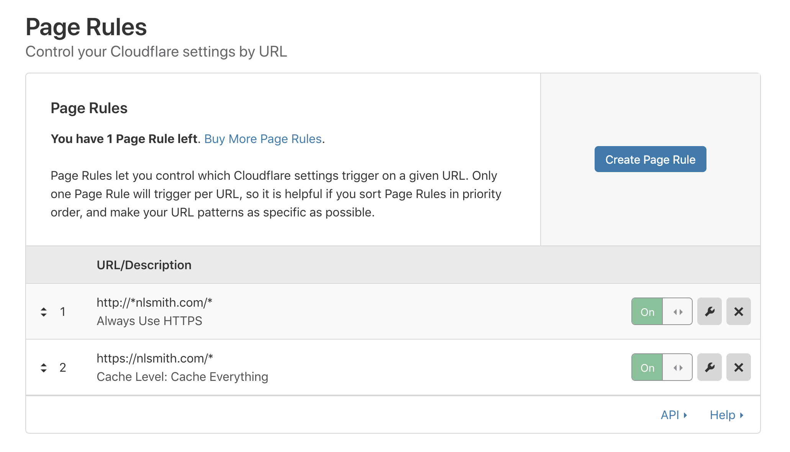

I've been hosting my own website, nlsmith.com, for over fifteen years. Most of
the time there hasn't been much on it, but it's a nice thing to have around.

I only recently started using it to write about things I learn, but I did used
to host some of the software projects and other things on here.

The current incarnation of the site uses [Gatsby](https://www.gatsbyjs.org/), a
very nice React-based static site generator.

Hosting a blog on Medium or WordPress would probably be easier, but I like being
able to own the hosting of my own content. It's just a tiny bit of control that
feels more in line with the dream of a decentralized web, where anybody can be a
publisher and not all content is funneled through a small number of corporations.

It's also nice to be able to just upload arbitrary files and make redirects to
alias URLs I use frequently (for instance, https://nlsmith.com/office goes to
my personal Zoom meeting and https://nlsmith.com/resume goes to my résumé hosted
on DropBox.)

I pay \$1.00 per month for hosting, so I'd like to explain how it's done in this
post.

You can get free hosting through [GitHub Pages](https://pages.github.com),
[ZEIT](https://zeit.co/home), or [Netlify](https://www.netlify.com/), but there
are some limitations.

This site is hosted on [Amazon S3](https://aws.amazon.com/s3/) (ok, ok, I said
earlier that I was trying to avoid some evil corporation hosting all my content,
but it doesn't have to be S3 I could host it on a server in my closet),
and uses the [Cloudflare](https://www.cloudflare.com) free plan for caching and
SSL.

### Travis CI

[Travis CI](https://travis-ci.org/) is used to deploy the site, though I might
attempt to switch it over to
[Github Actions](https://github.com/features/actions) soon. The
[.travis.yml](https://github.com/smith/nlsmith.com/blob/master/.travis.yml)
configuration file just tells it which tasks to run and has some environment
variables encrypted with `travis encrypt`.

### Cloudflare

With Cloudflare I've set up two [Page Rules](https://www.cloudflare.com/features-page-rules/). One to always use HTTPS and the other to cache everything:



Since we only have these two rules we can keep on the free plan while caching as
much as possible.

Caching everything works because we run this
[script to purge the Cloudflare cache](https://github.com/smith/nlsmith.com/blob/master/bin/purge-cloudflare-cache.sh)
every time we deploy:

`embed:../../../bin/purge-cloudflare-cache.sh`

### S3

Storing files in S3 is cheap, and with the Cloudflare caching you only have to transfer each file once, so you save on transfer costs, which also are cheap anyway.

The [Hosting a Static Website on Amazon S3](https://docs.aws.amazon.com/AmazonS3/latest/dev/WebsiteHosting.html) documentation describes how you can host a site on S3. If you try to do this by hand, things won't work the first time and it will be a frustrating experience. There's a lot to configure to make everything work: IAM users, redirects, bucket policies, user policies, etc.

I've done this by hand a few times and at one point was smart enough to make a [Terraform](https://www.terraform.io) script to automate pretty much everything about the process: [nlsmith.tf](https://github.com/smith/nlsmith.com/blob/master/terraform/nlsmith.com.tf)

It doesn't have all bucket and domain names abstracted out into variables, so if you were to use it directly you would have to replace "nlsmith.com" with the domain name you're using.

The [gatsby-plugin-s3](https://www.gatsbyjs.org/packages/gatsby-plugin-s3/) plugin is used to deploy the built assets. The default configuration doesn't set up the redirects quite how I want, so I added:

```js
{
  resolve: `gatsby-plugin-s3`,
  options: {
    bucketName: process.env.AWS_BUCKET || "test",
    generateRedirectObjectsForPermanentRedirects: true,
    generateRoutingRules: false
  }
}
```

to my gatsby-config.js. When running in Travis it sets the environment variables correctly and uploads the site to S3.

### Take this if you want it

So that's my setup. It's been working nicely for me. If you want to use it, please do. all the code is on GitHub in the [smith/nlsmith.com](https://github.com/smith/nlsmith.com) repository. Let me know if you are using something similar or better, I'd love to learn about it.
